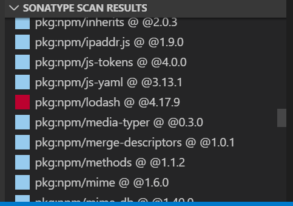
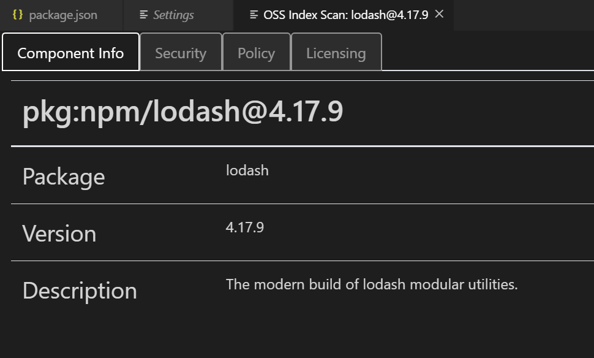
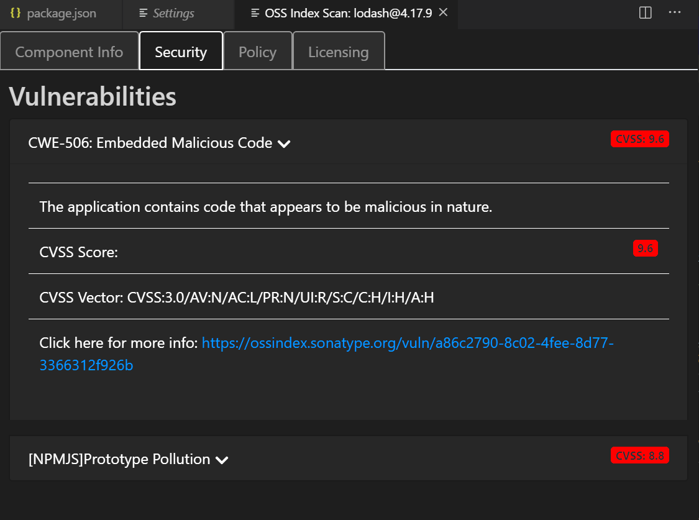
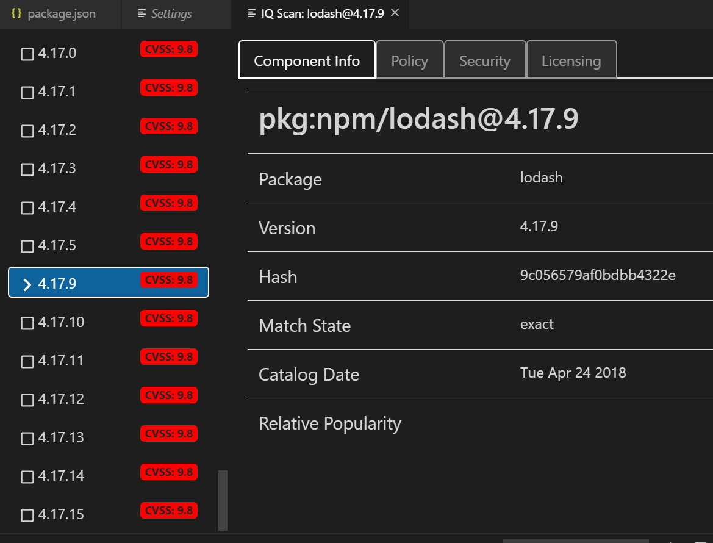
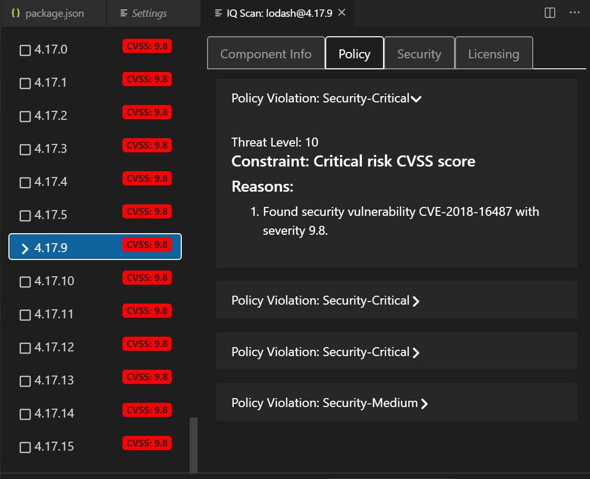
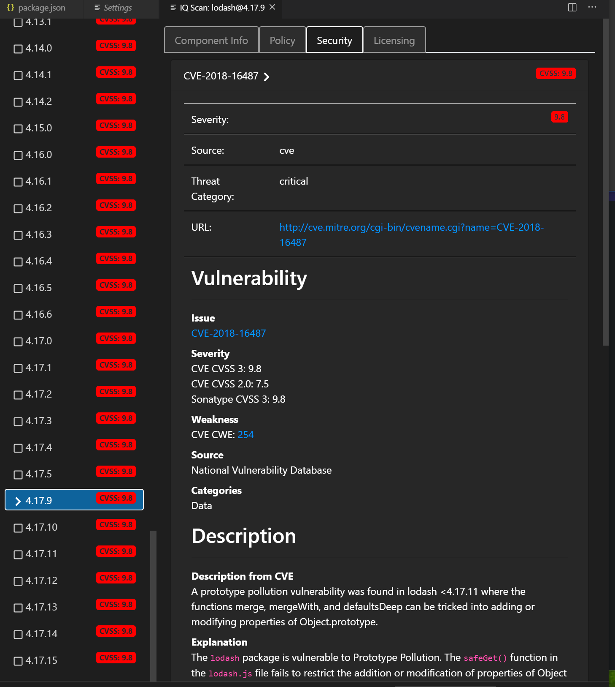
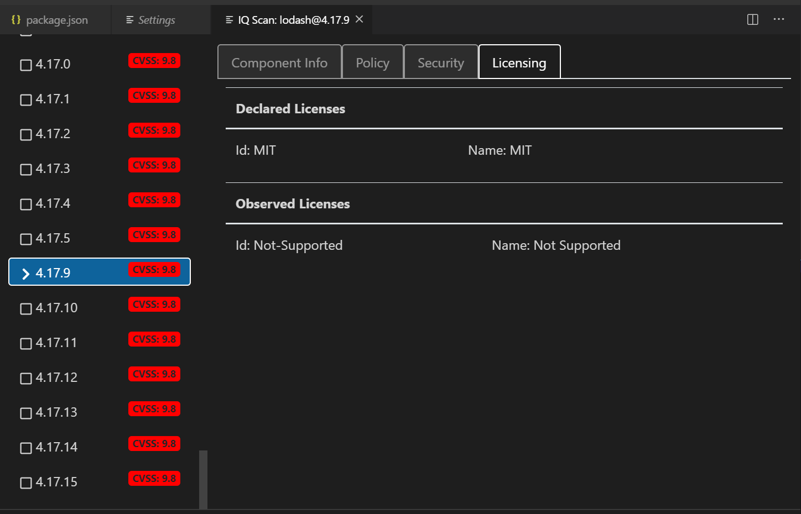

# Sonatype Nexus IQ Plugin for VS Code
Scan your libraries against either the free [OSS Index](https://ossindex.sonatype.org/) vulnerability database or the [Sonatype Nexus IQ Server](https://www.sonatype.com/nexus-iq-server). Drill down into all of your dependencies to examine each package version for security vulnerabilities. With IQ Server, it also provides policy and license details.

## Features

* Scan npm, Maven, Go or PyPi projects
* See all components with vulnerable components highlighted

## 

* OSS Index Component Details

* OSS Index Security Details

* IQ Server Component Info with version graph

* IQ Server Policy Info

* IQ Server Security

* IQ Server License browser

## Requirements
To enable the IQ Scan, you will need a Sonatype Nexus IQ Lifecycle License but the OSS Index scan will work for all users.

## Extension Settings
* Configuration is done in the VSCode `Preferences > Settings > Sonatype Explorer`
 

If you are using IQ Server, you can enter your password which will be stored in cleartext, or for additional security you can leave this blank and whenever you start VS Code (and if you have the Nexus Explorer Data Source set to `iqServer`) you will be prompted for a password:

If you are using IQ Server v76 or above, you can create a [user token](https://help.sonatype.com/iqserver/automating/rest-apis/user-token-rest-api---v2) and save this in the password field instead. The added benefit of doing this is that you are not storing your IQ Server password in plaintext, and rather a user token that can be deleted, etc... if need be.

