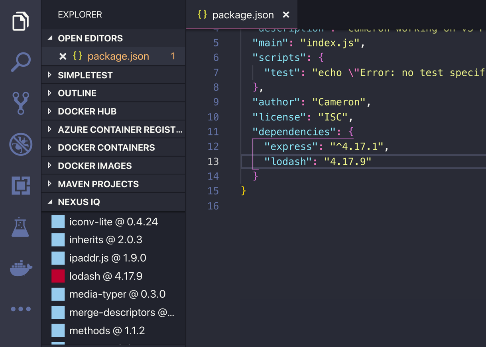
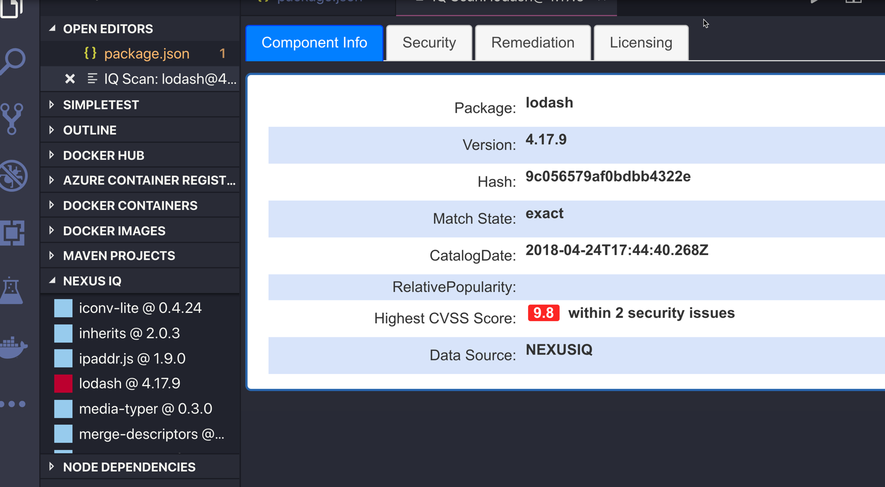
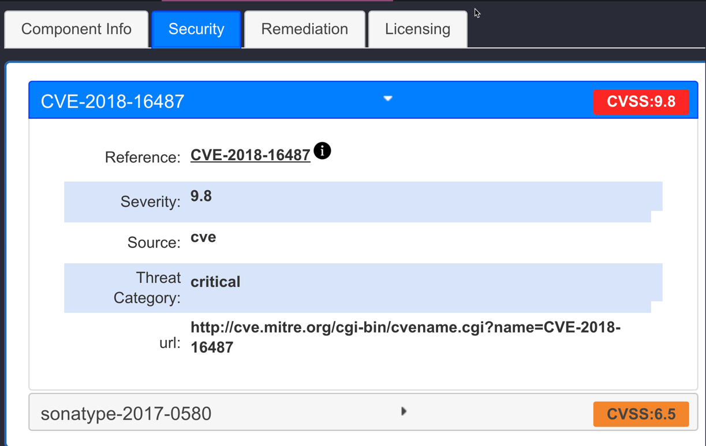
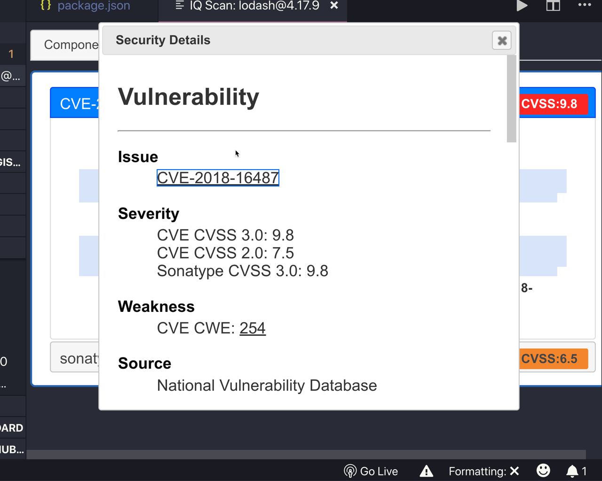
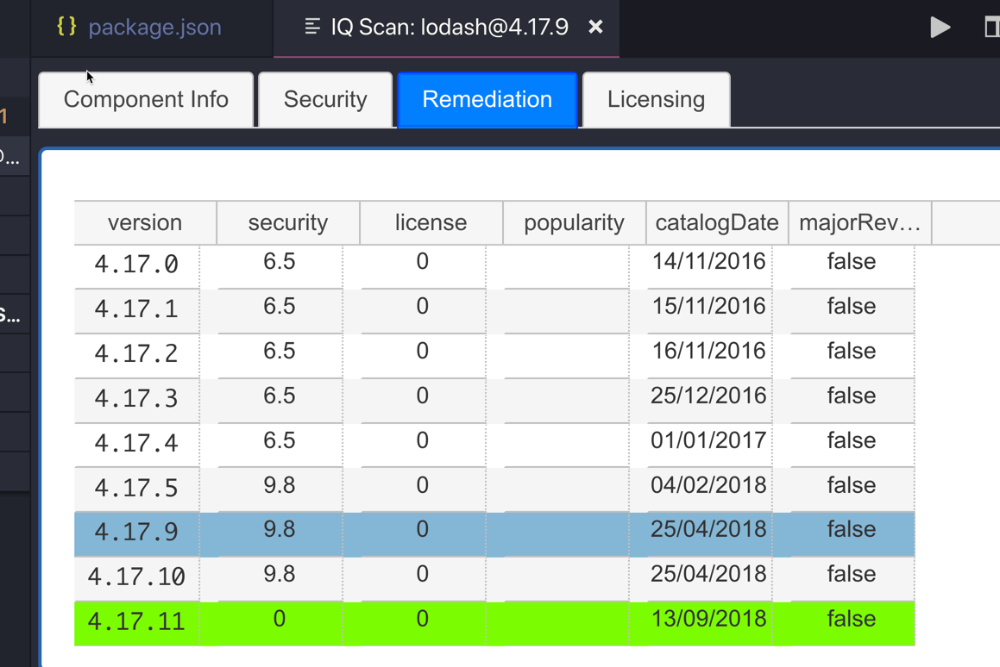
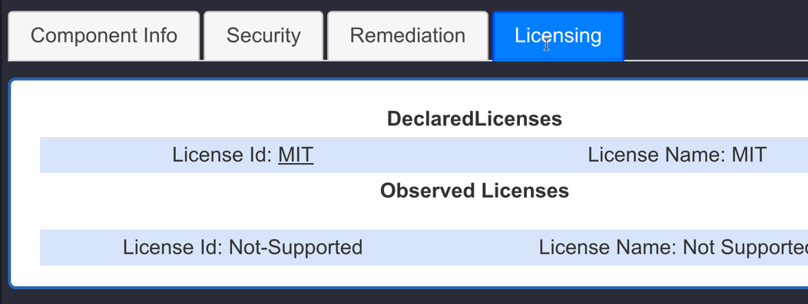
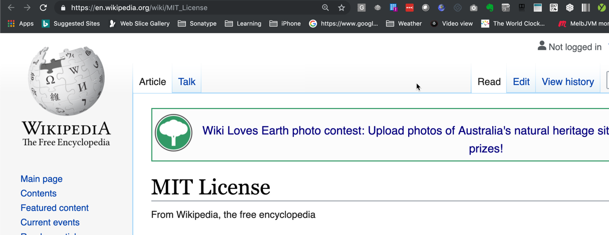
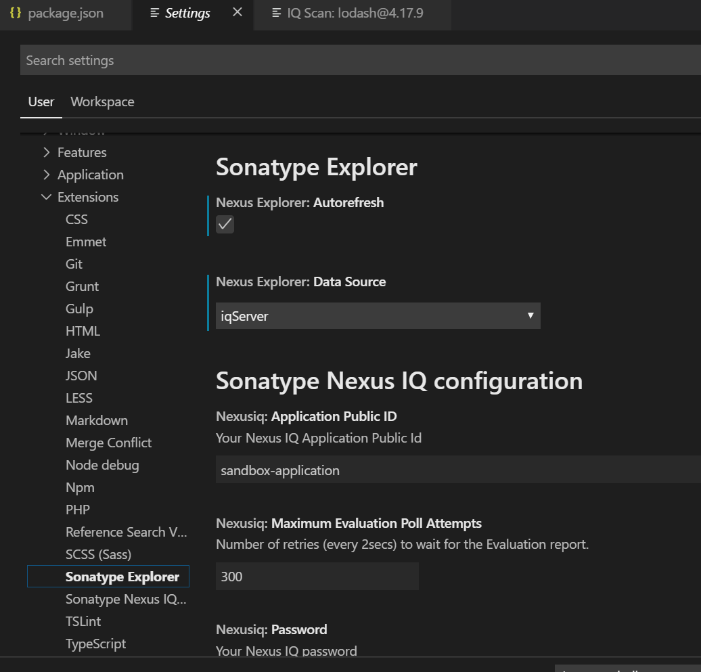
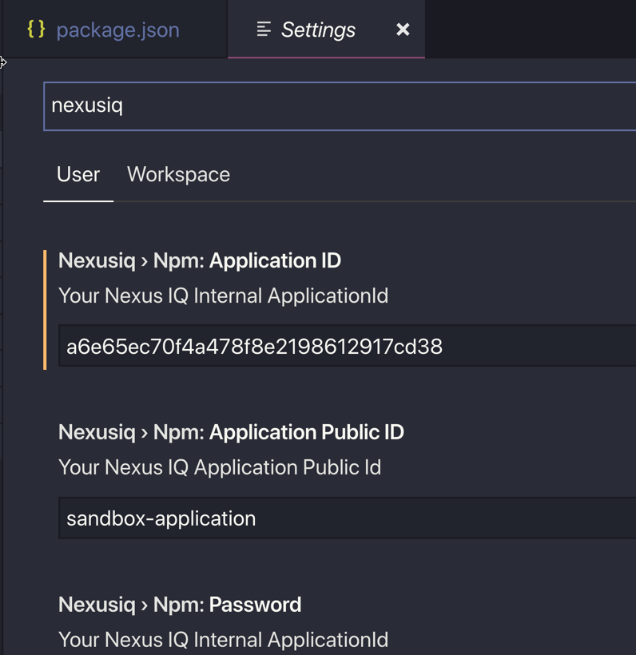

# vscode-iq-plugin
To run:
The plugin will create a new panel in your IDE called "Nexus IQ". It will automatically evaluate your components.

Currently it is limited to analyzing NPM projects.

Under the covers it does
1) Looks for a package.json
2) Performs a npm shrinkwrap
3) Submits an evaluation report to NexusIQ for the identified components
4) Creates a new panel called Nexus IQ in your VS Code Explorer.
5) Displays the components in the Nexus IQ PANEL

## Features
* NexusIQ Panel

* View Details by clicking on the pencil.

* Component Info Panel

* Security List

* Security Detail

* Remediation

* Licensing

* License Detail

## Requirements
You will need a Sonatype Nexus IQ Lifecycle License to be able to use this extension.

## Extension Settings
* Configuration is done in the VSCode Preferences > Settings

* Filter for NexusIQ and then make your changes

This extension contributes the following settings, all are required:

* `nexusiq.url`: URL including port of the Nexus IQ server
* `nexusiq.applicationPublicId`: Your Nexus IQ Application Public Id

### Authentication with IQ Server

You can set your username and password to authenticate with IQ Server via the following config:

* `nexusiq.username`: Your Nexus IQ user name
* `nexusiq.password`: Your Nexus IQ Internal ApplicationId

**WARNING: Your IQ password will obviously be saved in plaintext if you do this, please read further for more information. As well, if you do not set your password, the extension will prompt you for it when you start Visual Studio Code, which will prevent it from being saved in plaintext.**

**NOTE: We strongly suggest reading this and using the following method if you are on a version of IQ Server that supports it:**

As of release 76 of IQ Server, you can now create a user token to authenticate with IQ Server:

https://help.sonatype.com/iqserver/automating/rest-apis/user-token-rest-api---v2

You would set the same config options with the userCode and userToken you get from IQ Server and it will work exactly the same! The added benefit of doing this is that you are not storing your IQ Server password in plaintext, and rather a user token that can be deleted, etc... if need be.

## Known Issues
* You have to specify the Application Public Id and Application Internal UUID, this is a pain. I will create a GUI for this when I get to it. For now you have to work out your UUID. Call this end point to find the UUID - /api/v2/applications.
* Password is stored in plain text
* Styling of the Info panel needs some work

## Adding a format
1) Run `FORMAT=Maven npm run generate-format`, substituting the value for FORMAT for the name of the Format you are working on, example: `Maven` in this case
2) Implement the methods you need to in these newly generated classes, and then in `ext-src/packages/ComponentContainer.ts`, add your Implementation!
