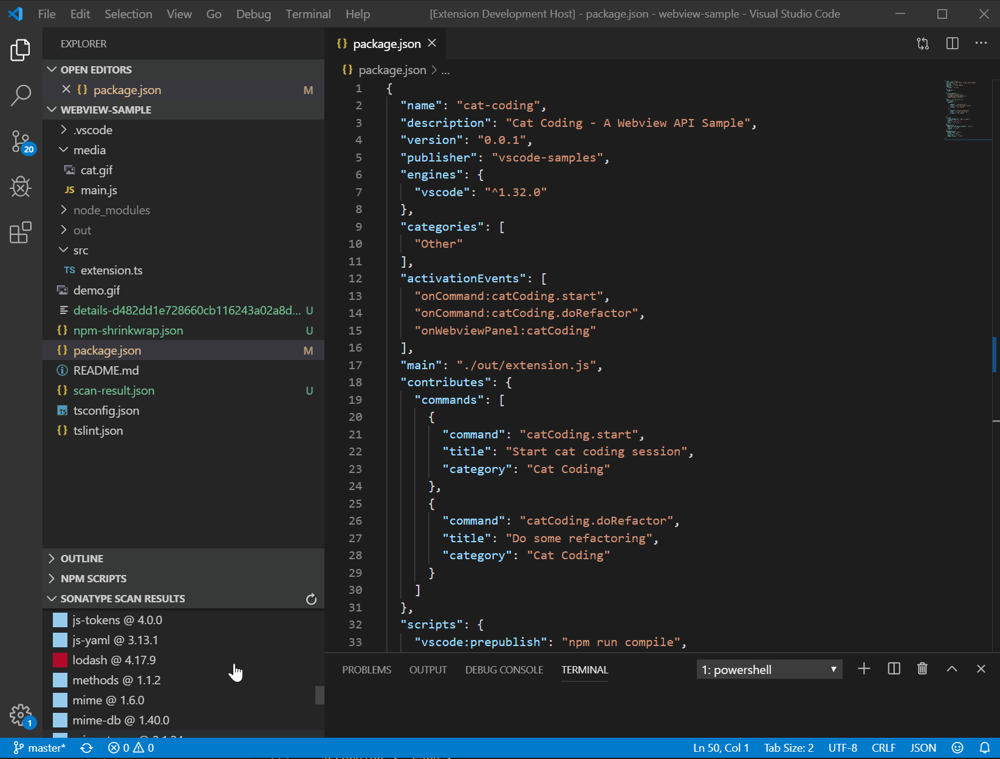
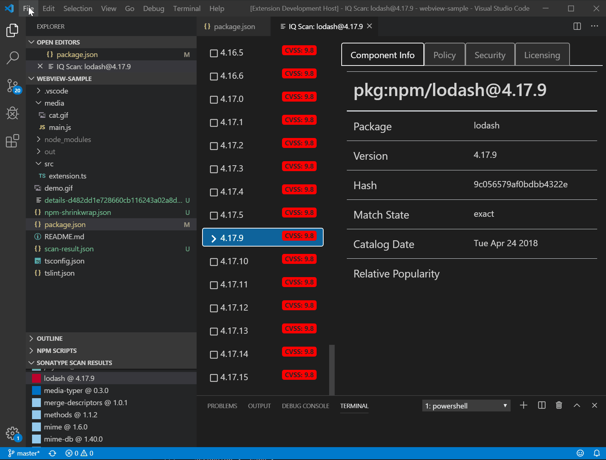
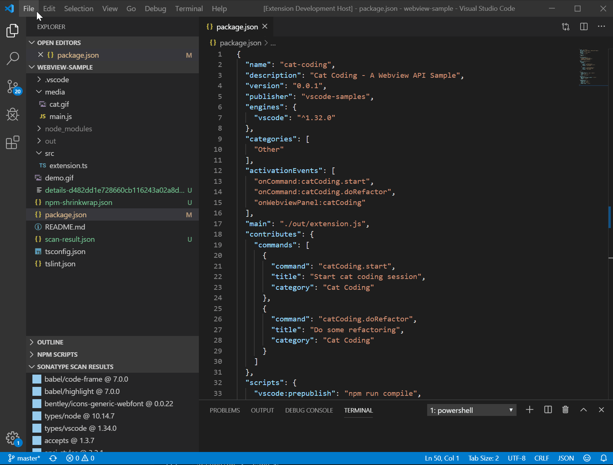
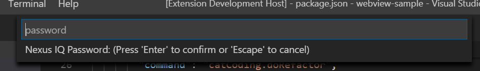

# Sonatype Nexus IQ Plugin for VS Code

Scan your libraries against either the free [OSS Index](https://ossindex.sonatype.org/) vulnerability database or the [Sonatype Nexus IQ Server](https://www.sonatype.com/nexus-iq-server). Drill down into all of your dependencies to examine each package version for security vulnerabilities. With IQ Server, it also provides policy and license details.[](https://github.com/sonatype-nexus-community/vscode-iq-plugin)

## Features

* Scan npm, Maven, RubyGems, Go or PyPi projects (Go is only supported on Linux or OS/X)
* See all components with vulnerable components highlighted

### Sonatype Nexus IQ Scan

 

### OSS Index Scan



### Themes



## Requirements
* To enable the IQ Scan, you will need a Sonatype Nexus IQ Lifecycle License but the OSS Index scan will work for all users
* The plugin requires npm, golang, maven, ruby / bundler, or python and pip to be installed, depending on which language you are using. It will not install these as a part of the plugin

## Extension Settings
* Configuration is done in the VSCode `Preferences > Settings > Sonatype Explorer`



If you are using IQ Server, you can enter your password which will be stored in cleartext, or for additional security you can leave this blank and whenever you start VS Code (and if you have the Nexus Explorer Data Source set to `iqServer`) you will be prompted for a password:



If you are using IQ Server v76 or above, you can create a [user token](https://help.sonatype.com/iqserver/automating/rest-apis/user-token-rest-api---v2) and save this in the password field instead. The added benefit of doing this is that you are not storing your IQ Server password in plaintext, and rather a user token that can be deleted, etc... if need be.

### Known Quirks

We try and use other tooling whenever possible, to avoid reinventing the wheel (that's what Open Source is about anyways, right!). However due to using this tooling, we are at the mercy of it, sometimes, so here's a list of quirks we've ran into while developing/using this extension ourself.

* Ruby Gems support depends on the installation of ruby, and bundler
  * If your ruby version mismatches what is declared in your Gemfile, bundler will not run properly
  * If you use rbenv, ensure your `.ruby-version` file matches your Gemfile
  * In order for the command we use to get your dependency list to output to succeed, you need to have run `bundle install`, as `bundle show` cannot track down what you use locally otherwise

* Golang support depends on an installation of Golang
  * We run `go mod list -m all` to get your dependency list
  * This includes test dependencies, so it might be noisy
  * It would seem due to this running in VS Code, it runs in a slightly different shell/user, and thus it downloads your dependencies. We set this to `/tmp/gocache` in code, which may not work on Windows (PRs welcome!), so it might be slowish on it's first run

* R support depends on R being available, and your project needs a `.Rbuildignore` file otherwise we cannot determine it's an R project
  * This extension also runs an R script to get your installed packages (currently the best way we know of to do this), the way we get these can be seen at `scripts/installed.r` in our GitHub repo

* Projects with both RubyGems and NPM (Gemfile.lock, and package.json), or similar
  * This extension currently picks one format, and scans for it. We haven't built a path to scan multiple project types, but that would be lovely. PRs welcome :)

* "My project has 3,000 dependencies, why is this so slow?!?"
  * We chunk up requests to OSS Index (free solution) in sections of 128 dependencies, so for 3,000 dependencies, you are making 24 https POST requests for information, and then it's merging those results, etc... We'd love to know your feedback on the tool, so if you do run into this, open up an issue and let us know!

## Development

Development requires running this project in Visual Studio Code, for ease of testing etc...

You'll need a working version of nodejs (we have been using 10.x and higher), and then:

```
npm i
```

Then:

```
npm run build
```

Then:

`Debug > Start Debugging`

If you are working on functionality that requires IQ Server, you'll need an instance running, and configured in the settings for the project. OSS Index should work right out of the box. 

We highly suggest installing "Webview Developer Tools" for this project, as the front end is written in React, and it's nice to have that to see what's going on. All of the React specific code can be found in `src`. The rest of the code is contained within `ext-src` and this is what communicates with either OSS Index or IQ Server.

## Contributing

We care a lot about making the world a safer place, and that's why we created this extension. If you as well want to speed up the pace of software development by working on this project, jump on in! Before you start work, create a new issue, or comment on an existing issue, to let others know you are!

## The Fine Print

It is worth noting that this is **NOT SUPPORTED** by Sonatype, and is a contribution of ours
to the open source community (read: you!)

Remember:

* Use this contribution at the risk tolerance that you have
* Do NOT file Sonatype support tickets related to this Visual Studio Code extension in regard to this project
* DO file issues here on GitHub, so that the community can pitch in

Phew, that was easier than I thought. Last but not least of all:

Have fun creating and using this extension and the [Sonatype OSS Index](https://ossindex.sonatype.org/), we are glad to have you here!

## Getting help

Looking to contribute to our code but need some help? There's a few ways to get information:

* Chat with us on [Gitter](https://gitter.im/sonatype/nexus-developers)
